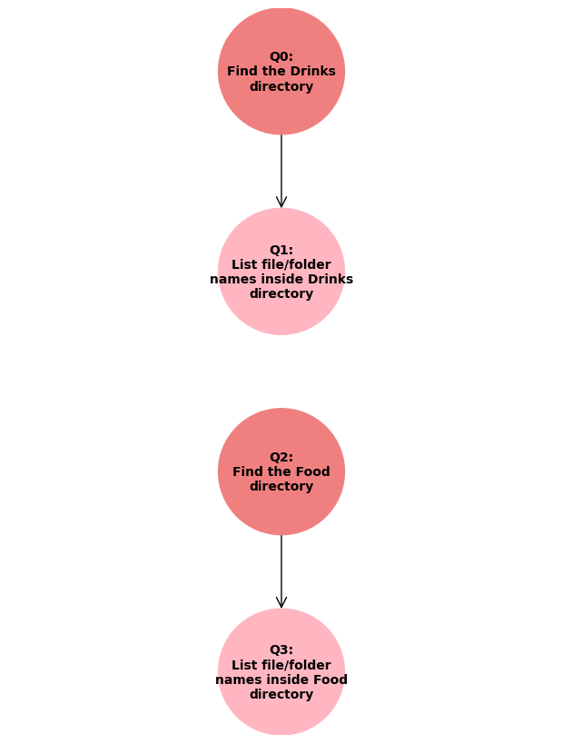

# README
The CLAI (Command Line AI) app is a chatgpt based assistant with access to your local files. You'll need a OPENAI_API_KEY. Run the app with `python chat.py` or `python chat.py "<your prompt>"`.

## Setup
You'll need to save the OPENAI_API_KEY as an environment variable or paste it in the **settings.json** file. 
You'll also need to set the root path for your local data and set the setting attributes `vs_load` and `email_load` to `true` to create the email database and knowledge base vectorstore for RAG.

### Settings

```json
{
    "chat_path": "./build/chats",
    "log_path": "./build/logs",
    "verbose": false,
    "kb_root_path": "./data/KnowledgeBase",
    "vs_path": "./build/Vectorstore",
    "vs_load": false,
    "db_path": "./build/email.db",
    "db_sql_schema_path": "emaildb.sql",
    "email_load": false,
    "email_path": "./build/Email",
    "email_address": "skirienkopanea@github.com",
    "email_folder": "Inbox",
    "email_count": 50,
    "appointment_count": 5,
    "graph_path": "./build/images/graph",
    "OPENAI_API_KEY": "<your OpenAI API key>"
}
```

**kb_root_path**: This is the root path of the files for the RAG document search. Don't forget to set up `vs_load` to `true` the first time and back to `false` for the next runs.

`email_count` number is the number of emails from newest to oldest that will be loaded.

`appointment_count` is the number of calendar appointments that will be loaded from the current date in advance.

`verbose` will print logs in the console.

## Features
The app is a semantic search RAG with the ability to chain "chatgpt" prompts with local files commands. It takes a user prompt as an argument i.e. `python chat.py "What are the ingredients of the pizza margherita?"` or you can execute it without arguments and write the prompt during the execution of `python chat.py`.

You can chain commands of the following categories:
* Email/Calendar search (Outlook)
* File/Directory search
* RAG (retrieval augmented generation) also known as document retrival for Q&A
    * RAG for all files inside knowledge base root directory
    * RAG filtered by specified file path
* General ChatGPT prompts

#### RAG: Knowledge base semantic search
`python chat.py "What are the colors of the flag of italy?"`

Output:
```txt
The colors of the Italian flag are green, white, and red.

Source: data\KnowledgeBase\Countries\Italy.txt
```

#### RAG: semantic search with filter by file
`python chat.py "From the pizza file tell me the colors of the flag of italy."`

Output:
```txt
The colors of the flag of Italy are red, green, and white. These colors are represented in the traditional Pizza Margherita, where red comes from tomato, green from basil, and white from mozzarella.
```

If you check the logs, it splits the query into 2 prompts:

```json
    {
        "question": "Locate the pizza file.",
        "question_id": 0,
        "category": "File/Directory search",
        "category_id": 2,
        "input_from": null,
        "output_to": 1,
        "output": "./data/KnowledgeBase/Food/Pizza_Margherita.txt"
    },
    {
        "question": "What are the colors of the flag of Italy?",
        "question_id": 1,
        "category": "Question about specific knowledge from the file",
        "category_id": 8,
        "input_from": 0,
        "output_to": null,
        "output": "The colors of the flag of Italy are red, green, and white. These colors are represented in the traditional Pizza Margherita, where red comes from tomato, green from basil, and white from mozzarella."
    }
```

Each of these prompts calls openai under the hood with the following prompts:

```json
{
    "Query": "Locate the pizza file.",
    "Model": "gpt-4o-mini",
    "System prompt": "You are a path finder machine.
    From the list of paths provided, find the requested file or folder paths according to the question. 
    Your answer must only contain the relevant paths separated by ':'.
    Paths: ['./data/KnowledgeBase', './data/KnowledgeBase/Birthdays.csv', './data/KnowledgeBase/Countries', './data/KnowledgeBase/Countries/Italy.txt', './data/KnowledgeBase/Drinks', './data/KnowledgeBase/Drinks/cafe_con_leche.txt', './data/KnowledgeBase/Drinks/Water.txt', './data/KnowledgeBase/Drinks/Images', './data/KnowledgeBase/Drinks/Images', './data/KnowledgeBase/Food', './data/KnowledgeBase/Food/Cheese_Burger.txt', './data/KnowledgeBase/Food/Pizza_Margherita.txt', './data/KnowledgeBase/Food/Images', './data/KnowledgeBase/Food/Images', './data/KnowledgeBase/Games', './data/KnowledgeBase/Games/Fortune Teller.txt', './data/KnowledgeBase/Games/SQL', './data/KnowledgeBase/Games/SQL', './data/KnowledgeBase/Work', './data/KnowledgeBase/Work/Misc', './data/KnowledgeBase/Work/Misc/Employees.csv', './data/KnowledgeBase/Work/Misc/Helloworld.txt']",
    "User prompt": "Question: Locate the pizza file.",
    "Response": "./data/KnowledgeBase/Food/Pizza_Margherita.txt"
}
```
```json
{
    "Query": "What are the colors of the flag of Italy?",
    "Model": "gpt-4o-mini",
    "System prompt": "Answer the question about the contents of the file. Don't use outside information.
            If the contents are file paths and you can't provide an answer, then say 'Path (path) couldn't match any info based on your query. Try to type your query differently'.
            If the contents are empty or simply irrelevant and not file paths, then just say that you don't have the context to provide an answer and explain what is mentioned in the context.",        
    "User prompt": "Question: What are the colors of the flag of Italy?
    Contents: A popular contemporary legend holds that the archetypal pizza Margherita was invented in June 1889, when the Royal Palace of Capodimonte commissioned the Neapolitan pizzaiolo Raffaele Esposito to create a pizza in honor of the visiting Queen Margherita. Of the three different pizzas he created, the Queen strongly preferred a pizza swathed in the colors of the Italian flag�red (tomato), green (basil), and white (mozzarella). [7] Supposedly, this type of pizza was then named after the Queen
",
    "Response": "The colors of the flag of Italy are red, green, and white. These colors are represented in the traditional Pizza Margherita, where red comes from tomato, green from basil, and white from mozzarella."
}
```

You can also check the png graph generated at the settings `graph_path` to visualize how your query was executed by the assistant. See **graph_example.png** for query *"Find the Drinks and Food directories and tell me the file names"*



### Email and general chatgpt prompts example

`python chat.py "Get the emails with subject like 'Automatic reply' and output in a csv format employee_name,comeback_date"`

Under the hood:

```json
{
        "question": "Get the emails with subject like 'Automatic reply'",
        "question_id": 0,
        "category": "Email/Attachment search",
        "category_id": 0,
        "input_from": null,
        "output_to": 1
    },
    {
        "question": "Output in a csv format employee_name,comeback_date",
        "question_id": 1,
        "category": "Print subset data of file contents to console",
        "category_id": 12,
        "input_from": 0,
        "output_to": null
    }
```

Output:
```csv
employee_name,comeback_date
Foo,02/09/2024
Bar,09/09/2024
```

You can find more examples in the **sample_queries.txt** file.

## Backlog
* use online vectorstore
* change CSV for SQL uploader
* make web chat
* make upload file text loader for rag for single file
* make the possibility to send emails and set appointments
* make the possibility to write files and folders
* optimize rag (rag by filepath, rag by file summary, rag by file contents, rag by other metadata?)